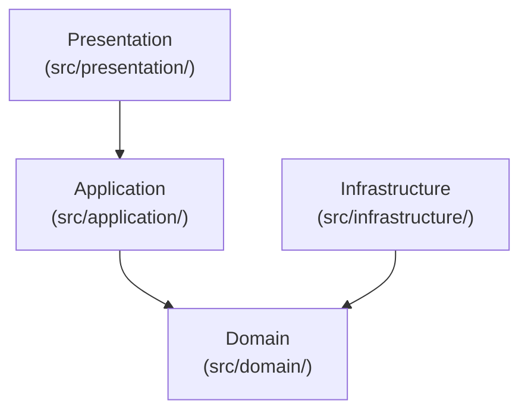
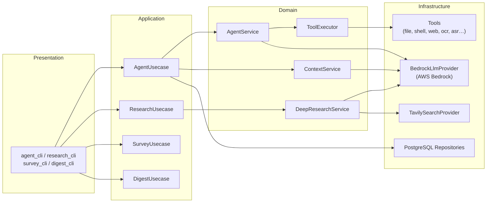
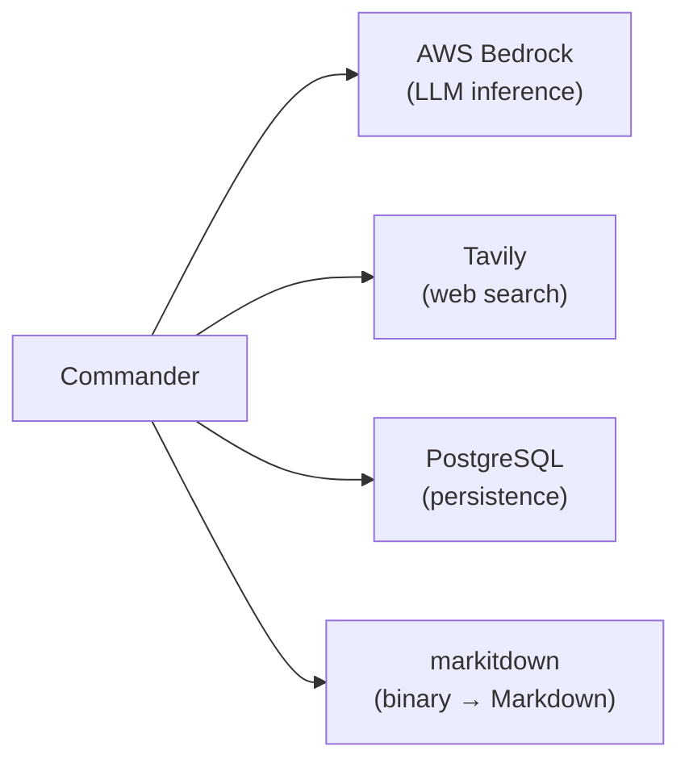

# Architecture

## Layers

Commander follows clean architecture. Dependencies flow inward; the domain has no knowledge of infrastructure.

| Layer          | Responsibility                                     |
| -------------- | -------------------------------------------------- |
| Presentation   | CLI I/O, argument parsing, progress display        |
| Application    | Usecase orchestration                              |
| Domain         | Models, port interfaces, business logic            |
| Infrastructure | External service adapters (LLM, DB, search, tools) |

## Component Overview

## Domain

**Ports** (interfaces implemented by infrastructure):

- `LlmProvider` — inference (`response`, `response_with_tool`, `response_with_structure`)
- `SearchProvider` — web search
- `Tool` — name, spec, default policy, execution logic

**Repositories**: `ChatSession`, `ChatMessage`, `TokenUsage`, `ToolApproval`, `ToolExecutionRule`

**Services**:

- `AgentService` — LLM + tool loop, approval pause/resume
- `ContextService` — context window management and compaction
- `ToolExecutor` — tool lookup, policy resolution, execution
- `DeepResearchService` — iterative deep research (TTD-DR algorithm)

## External Dependencies

## Further Reading

- [process.md](process.md) — Agent loop and approval flow
- [sequence.md](sequence.md) — Detailed sequence diagrams
- [tools.md](tools.md) — Tool list and execution policy
- [database.md](database.md) — Database schema
- [context.md](context.md) — Context window management
- [deep-research.md](deep-research.md) — Deep research algorithm
