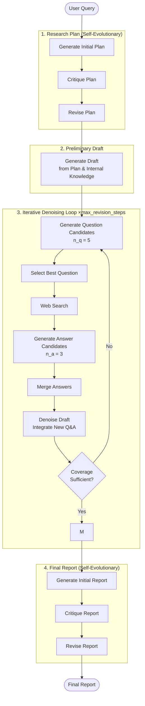

# Deep Research Processing Flow

Based on **R. Han et al., "Deep Researcher with Test-Time Diffusion"** (arXiv:2507.16075).

Implements the TTD-DR framework: a draft is iteratively refined ("denoised") using retrieved external information via a self-evolutionary algorithm.

Key parameters: `max_revision_steps` = 3, `n_q` = 5, `n_a` = 3.

## Processing Flow

## Component Details

| Component           | Description                                                     |
| ------------------- | --------------------------------------------------------------- |
| Research Plan       | 3 LLM calls: generate → critique → revise                       |
| Preliminary Draft   | Written from LLM internal knowledge, structured around the plan |
| Question generation | `n_q = 5` candidates targeting draft gaps; best one selected    |
| Answer retrieval    | Web search + `n_a = 3` candidate answers merged into one        |
| Draft denoising     | Full draft revised with new Q&A; reduces gaps                   |
| Exit check          | LLM evaluates plan coverage; exits early if sufficient          |
| Final Report        | Same critique-and-revision loop applied to the completed draft  |
