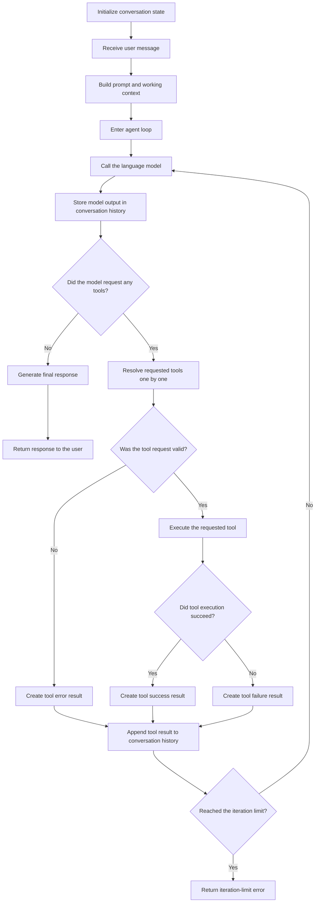

# Agent Process Flow

This document describes the current processing flow at a high level.

## Main Flow

## Notes

- The flow starts from a user message and ends when the agent can return a final response.
- If the model requests tools, their results are added back into the conversation before the next model call.
- Tool handling is sequential in the current implementation.
- If the loop exceeds the allowed number of iterations, the process ends with an error.
