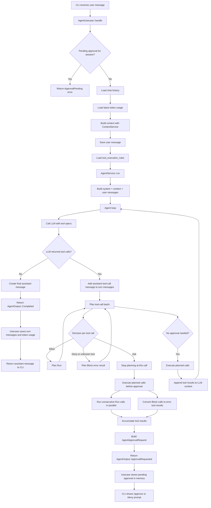

# Agent Process Flow

See [architecture.md](architecture.md) for component responsibilities.

## Main Flow



## Tool Execution Decisions

| Tool policy        | Stored rule       | Decision                                        |
| ------------------ | ----------------- | ----------------------------------------------- |
| `Auto`             | none              | `Allow`                                         |
| `Ask`              | none              | `Ask`                                           |
| `ConfirmEveryTime` | any non-deny rule | `Ask`                                           |
| any policy         | `allow`           | `Allow` (except `ConfirmEveryTime` stays `Ask`) |
| any policy         | `ask`             | `Ask`                                           |
| any policy         | `deny`            | `Deny`                                          |

Denied and unknown tools return an error result to the LLM without executing.

## Planned Tool Calls

Each tool call in a batch is planned as one of:

- `Run` — execute
- `Block` — return error result without executing
- `PendingToolApproval` — pause loop before this call

Execution preserves order while parallelizing safe calls:

```
Run, Run, Block, Run  →  parallel(Run, Run), Block result, parallel(Run)
```

## Approval Request Flow

1. Runnable calls before the approval point are executed.
2. Results are stored in `AgentApprovalRequest.accumulated_tool_results`.
3. The approval target and remaining calls are stored in memory keyed by `session_id`.
4. CLI shows `/approve` or `/deny` prompt.

## Approve Flow

1. Approval decision written to `tool_call_approvals`.
2. Current `tool_execution_rules` reloaded.
3. Pending tool re-checked; executed if allowed, error result if denied.
4. Remaining tool calls processed with current rules.
5. Turn messages and token usage saved on completion.
6. Pending approval cleared after successful save.

## Deny Flow

1. Denial decision written to `tool_call_approvals`.
2. Accumulated tool results, denied tool result, and skipped tool results persisted.
3. Assistant denial message saved.
4. Pending approval cleared.

## Persistence

| What                   | Where                  |
| ---------------------- | ---------------------- |
| Chat messages          | `chat_messages`        |
| Token usage            | `token_usages`         |
| Approval decisions     | `tool_call_approvals`  |
| Tool execution rules   | `tool_execution_rules` |
| Pending approval state | In-memory only         |
