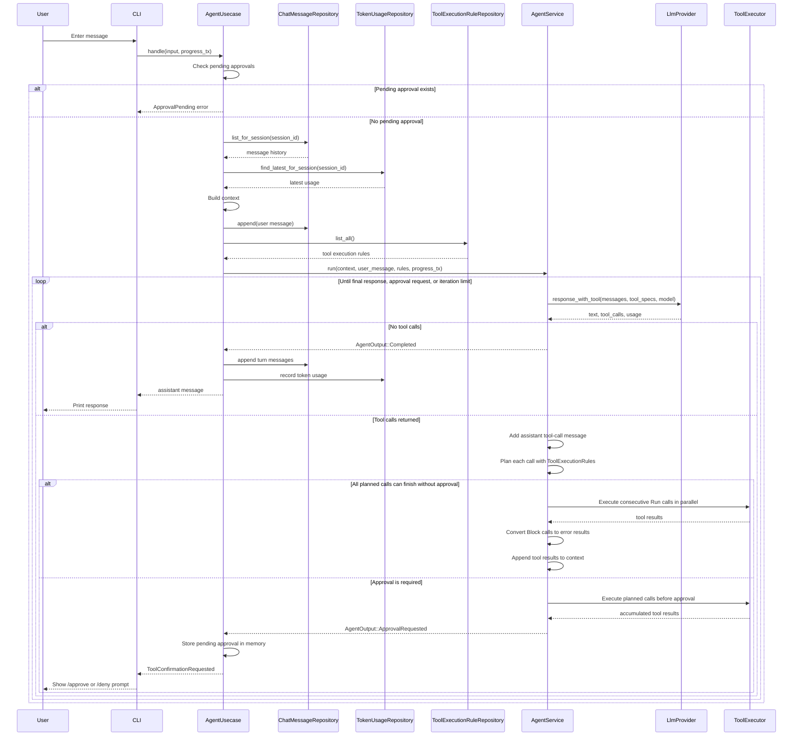
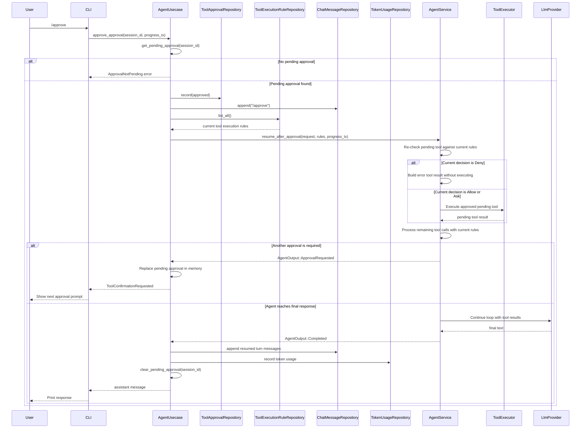
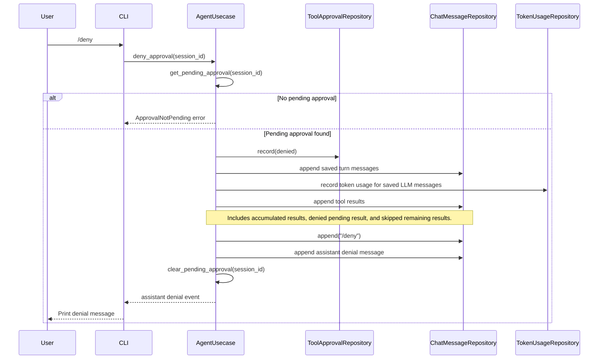
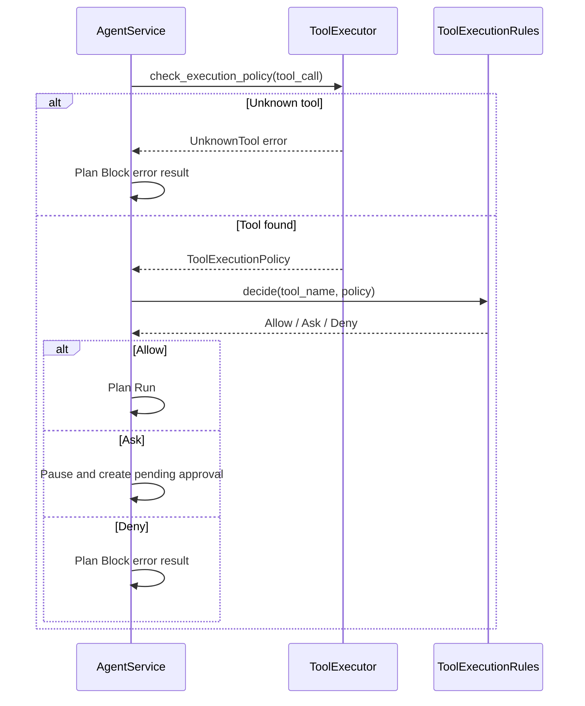

# Agent Sequence Diagrams

## Normal Message Flow

```mermaid
sequenceDiagram
    participant User
    participant CLI
    participant Usecase as AgentUsecase
    participant ChatRepo as ChatMessageRepository
    participant TokenRepo as TokenUsageRepository
    participant RuleRepo as ToolExecutionRuleRepository
    participant Agent as AgentService
    participant LLM as LlmProvider
    participant Tools as ToolExecutor

    User->>CLI: Enter message
    CLI->>Usecase: handle(input, progress_tx)
    Usecase->>Usecase: Check pending approvals

    alt Pending approval exists
        Usecase-->>CLI: ApprovalPending error
    else No pending approval
        Usecase->>ChatRepo: list_for_session(session_id)
        ChatRepo-->>Usecase: message history
        Usecase->>TokenRepo: find_latest_for_session(session_id)
        TokenRepo-->>Usecase: latest usage
        Usecase->>Usecase: Build context
        Usecase->>ChatRepo: append(user message)
        Usecase->>RuleRepo: list_all()
        RuleRepo-->>Usecase: tool execution rules
        Usecase->>Agent: run(context, user_message, rules, progress_tx)

        loop Until final response, approval request, or iteration limit
            Agent->>LLM: response_with_tool(messages, tool_specs, model)
            LLM-->>Agent: text, tool_calls, usage

            alt No tool calls
                Agent-->>Usecase: AgentOutput::Completed
                Usecase->>ChatRepo: append turn messages
                Usecase->>TokenRepo: record token usage
                Usecase-->>CLI: assistant message
                CLI-->>User: Print response
            else Tool calls returned
                Agent->>Agent: Add assistant tool-call message
                Agent->>Agent: Plan each call with ToolExecutionRules

                alt All planned calls can finish without approval
                    Agent->>Tools: Execute consecutive Run calls in parallel
                    Tools-->>Agent: tool results
                    Agent->>Agent: Convert Block calls to error results
                    Agent->>Agent: Append tool results to context
                else Approval is required
                    Agent->>Tools: Execute planned calls before approval
                    Tools-->>Agent: accumulated tool results
                    Agent-->>Usecase: AgentOutput::ApprovalRequested
                    Usecase->>Usecase: Store pending approval in memory
                    Usecase-->>CLI: ToolConfirmationRequested
                    CLI-->>User: Show /approve or /deny prompt
                end
            end
        end
    end
```

## Approve Flow

```mermaid
sequenceDiagram
    participant User
    participant CLI
    participant Usecase as AgentUsecase
    participant ApprovalRepo as ToolApprovalRepository
    participant RuleRepo as ToolExecutionRuleRepository
    participant ChatRepo as ChatMessageRepository
    participant TokenRepo as TokenUsageRepository
    participant Agent as AgentService
    participant Tools as ToolExecutor
    participant LLM as LlmProvider

    User->>CLI: /approve
    CLI->>Usecase: approve_approval(session_id, progress_tx)
    Usecase->>Usecase: get_pending_approval(session_id)

    alt No pending approval
        Usecase-->>CLI: ApprovalNotPending error
    else Pending approval found
        Usecase->>ApprovalRepo: record(approved)
        Usecase->>ChatRepo: append("/approve")
        Usecase->>RuleRepo: list_all()
        RuleRepo-->>Usecase: current tool execution rules
        Usecase->>Agent: resume_after_approval(request, rules, progress_tx)

        Agent->>Agent: Re-check pending tool against current rules

        alt Current decision is Deny
            Agent->>Agent: Build error tool result without executing
        else Current decision is Allow or Ask
            Agent->>Tools: Execute approved pending tool
            Tools-->>Agent: pending tool result
        end

        Agent->>Agent: Process remaining tool calls with current rules

        alt Another approval is required
            Agent-->>Usecase: AgentOutput::ApprovalRequested
            Usecase->>Usecase: Replace pending approval in memory
            Usecase-->>CLI: ToolConfirmationRequested
            CLI-->>User: Show next approval prompt
        else Agent reaches final response
            Agent->>LLM: Continue loop with tool results
            LLM-->>Agent: final text
            Agent-->>Usecase: AgentOutput::Completed
            Usecase->>ChatRepo: append resumed turn messages
            Usecase->>TokenRepo: record token usage
            Usecase->>Usecase: clear_pending_approval(session_id)
            Usecase-->>CLI: assistant message
            CLI-->>User: Print response
        end
    end
```

## Deny Flow

```mermaid
sequenceDiagram
    participant User
    participant CLI
    participant Usecase as AgentUsecase
    participant ApprovalRepo as ToolApprovalRepository
    participant ChatRepo as ChatMessageRepository
    participant TokenRepo as TokenUsageRepository

    User->>CLI: /deny
    CLI->>Usecase: deny_approval(session_id)
    Usecase->>Usecase: get_pending_approval(session_id)

    alt No pending approval
        Usecase-->>CLI: ApprovalNotPending error
    else Pending approval found
        Usecase->>ApprovalRepo: record(denied)
        Usecase->>ChatRepo: append saved turn messages
        Usecase->>TokenRepo: record token usage for saved LLM messages
        Usecase->>ChatRepo: append tool results
        Note over Usecase,ChatRepo: Includes accumulated results, denied pending result, and skipped remaining results.
        Usecase->>ChatRepo: append("/deny")
        Usecase->>ChatRepo: append assistant denial message
        Usecase->>Usecase: clear_pending_approval(session_id)
        Usecase-->>CLI: assistant denial event
        CLI-->>User: Print denial message
    end
```

## Rule Evaluation Sequence

```mermaid
sequenceDiagram
    participant Agent as AgentService
    participant Tools as ToolExecutor
    participant Rules as ToolExecutionRules

    Agent->>Tools: check_execution_policy(tool_call)

    alt Unknown tool
        Tools-->>Agent: UnknownTool error
        Agent->>Agent: Plan Block error result
    else Tool found
        Tools-->>Agent: ToolExecutionPolicy
        Agent->>Rules: decide(tool_name, policy)
        Rules-->>Agent: Allow / Ask / Deny

        alt Allow
            Agent->>Agent: Plan Run
        else Ask
            Agent->>Agent: Pause and create pending approval
        else Deny
            Agent->>Agent: Plan Block error result
        end
    end
```
